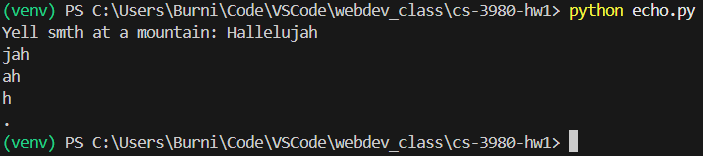
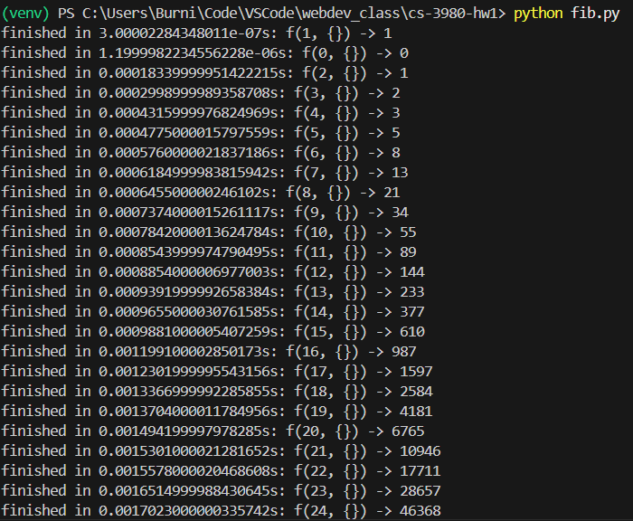
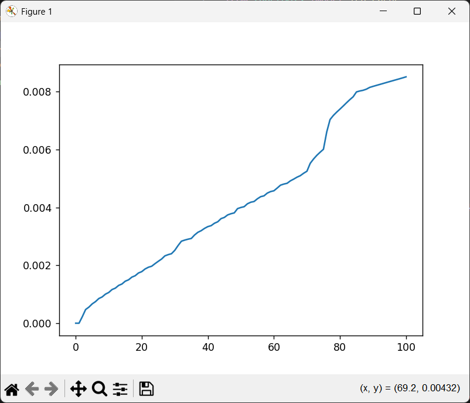

# cs-3980-hw1

## echo.py
Prompts the user for some input, and then repeats the last 3 characters to simulate an echo effect.

example:

## fib.py
Calculates the fibonacci sequence up to the 100th term, and prints the time it took to get each number.

example output:

example performance graph:
The x axis is the number input to the `fib()` function, and the y axis is the time taken for that input.

